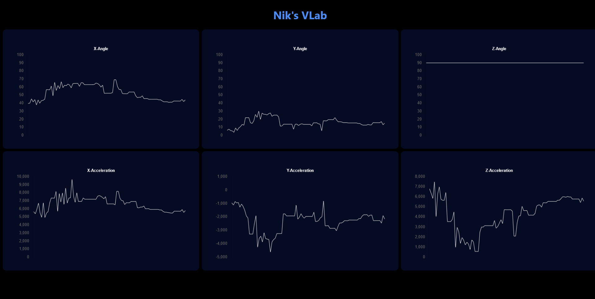

# realitme-charts-with-esp32-over-Websocket

## Project Demo

Real-time XYZ Acceleration and Angle Visualization with ESP32, MPU6050, WebSocket, and Chart.js

Welcome to the Real-time XYZ Acceleration and Angle Visualization project! This project combines cutting-edge technologies to create a real-time visualization of XYZ acceleration and angle orientation using an ESP32 microcontroller, an MPU6050 sensor, WebSocket communication, and the Chart.js library. Whether you're an IoT enthusiast, a data visualization aficionado, or someone keen on exploring motion tracking, this project offers an exciting blend of hardware and software to achieve a dynamic and informative visualization.

## WEB UI : 

## Components

ESP32 Microcontroller: The ESP32 serves as the brain of this project, responsible for reading data from the MPU6050 sensor and broadcasting it to connected clients via WebSocket.

MPU6050 Sensor: The MPU6050 is a versatile motion tracking device that houses both an accelerometer and a gyroscope. It provides accurate measurements of XYZ acceleration and angle orientation.

WebSocket Communication: To achieve real-time data transmission, we've employed WebSocket communication. This technology allows seamless and low-latency data exchange between the ESP32 and the connected visualization interface.

Chart.js Library: Chart.js is a powerful JavaScript library for creating interactive and dynamic charts. In this project, we leverage Chart.js to visualize the real-time XYZ acceleration and angle data in an intuitive and visually appealing manner.